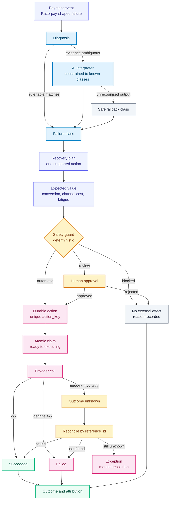

# Folio — Personal Finance Manager

<div align="center">

**A secure, full-stack workspace for tracking money, understanding spending, and reaching savings goals.**

[](https://spring.io/projects/spring-boot)
[](https://react.dev/)
[](https://www.typescriptlang.org/)
[](https://www.docker.com/)
[](https://render.com/)

[Features](#features) · [Architecture](#architecture) · [Run locally](#run-locally) · [API](#api-overview)

[](https://render.com/deploy?repo=https://github.com/Shubhamsah27/personal-finance-manager-assignment)

</div>

## About

Folio brings transactions, custom categories, savings goals, and financial reports into a single responsive dashboard. Spring Security keeps every record scoped to its owner, while the React interface turns day-to-day financial activity into a clean, interactive experience.

## Features

- Secure registration, login, logout, and server-managed sessions
- Income and expense tracking with exact `BigDecimal` money handling
- Global defaults and user-created categories
- Savings goals with progress calculated from live transaction data
- Monthly and yearly income, expense, and balance reports
- Soft deletion for consistent historical calculations
- Responsive 3D dashboard with reduced-motion support
- Consistent JSON error responses and a health-check endpoint
- Multi-stage Docker image and free-tier Render Blueprint
- Integration testing with an enforced 80% JaCoCo coverage floor

## Architecture



The flow keeps AI interpretation constrained, applies deterministic safety checks before any external effect, and reconciles uncertain provider outcomes before assigning a final result.

## Technology

| Layer | Stack |
| --- | --- |
| Frontend | React 19, TypeScript, Vite, React Three Fiber, Drei, Lucide |
| Backend | Java 17, Spring Boot 3.5, Spring Security, Spring Data JPA |
| Database | File-backed H2 |
| Testing | JUnit, Spring Boot Test, Spring Security Test, JaCoCo |
| Delivery | Multi-stage Docker build, Render Blueprint |

## Run locally

### Prerequisites

- Java 17 or newer
- Node.js 20 or newer

Start the API:

```powershell
cd backend
.\mvnw.cmd spring-boot:run
```

In another terminal, start the client:

```powershell
cd frontend
npm install
npm run dev
```

Open [http://localhost:5173](http://localhost:5173). Vite proxies `/api` requests to the backend on port `8080`.

### Run with Docker

From the repository root:

```bash
docker build -t folio .
docker run --rm -p 8080:8080 -e PORT=8080 folio
```

Then open [http://localhost:8080](http://localhost:8080).

## Configuration

| Variable | Default | Purpose |
| --- | --- | --- |
| `PORT` | `8080` | Spring Boot HTTP port |
| `SPRING_PROFILES_ACTIVE` | — | Use `prod` for production settings |
| `SESSION_COOKIE_SECURE` | `false` | Restrict the session cookie to HTTPS |
| `DATABASE_URL` | `jdbc:h2:file:./data/finance;AUTO_SERVER=TRUE` | JDBC database connection |
| `VITE_API_URL` | `/api` | API base URL for a separately hosted client |

## API overview

Authentication creates a `JSESSIONID` cookie. Protected resources derive ownership from the authenticated user rather than accepting a user ID from the client.

| Area | Endpoints |
| --- | --- |
| Health | `GET /api/health` |
| Authentication | `POST /api/auth/register`, `POST /api/auth/login`, `POST /api/auth/logout` |
| Transactions | `GET/POST /api/transactions`, `PUT/DELETE /api/transactions/{id}` |
| Categories | `GET/POST /api/categories`, `DELETE /api/categories/{name}` |
| Savings goals | `GET/POST /api/goals`, `GET/PUT/DELETE /api/goals/{id}` |
| Reports | `GET /api/reports/monthly/{year}/{month}`, `GET /api/reports/yearly/{year}` |

## Verify

Run the backend tests and coverage gate:

```powershell
cd backend
.\mvnw.cmd clean verify
```

Type-check and build the frontend:

```powershell
cd frontend
npm run build
```

## Deploy on Render

The repository includes a production [Dockerfile](./Dockerfile) and a [Render Blueprint](./render.yaml) pinned to the free web-service plan.

1. Click **Deploy to Render** near the top of this page.
2. Connect this GitHub repository.
3. Review the `folio-finance-manager` service.
4. Apply the Blueprint and follow the build logs.
5. Render marks the service healthy after `GET /api/health` succeeds.

> [!IMPORTANT]
> Free Render web services use an ephemeral filesystem and can spin down when idle. H2 data can be lost during service replacement or redeployment. For durable production use, attach persistent storage on a supported plan or migrate to a managed database.

## Project structure

```text
.
├── backend/                 Spring Boot API, business logic, and tests
├── frontend/                React application and 3D dashboard
├── Dockerfile               Combined production image
├── docker-compose.yml       Local multi-service setup
└── render.yaml              Free-tier Render Blueprint
```

## Key design decisions

- **Same-origin production** keeps secure session authentication straightforward.
- **Exact monetary values** use `BigDecimal` instead of floating-point numbers.
- **User-scoped access** is enforced on the server for every protected resource.
- **Soft transaction deletion** preserves history while excluding removed entries from calculations.
- **Idempotent defaults** safely seed seven protected global categories.
- **Predictable failures** use a shared `status`, `message`, `timestamp`, and `path` shape.

---

<div align="center">

Built as a focused demonstration of secure, production-minded full-stack engineering.

</div>
